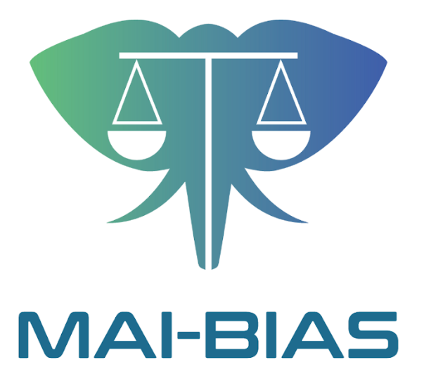
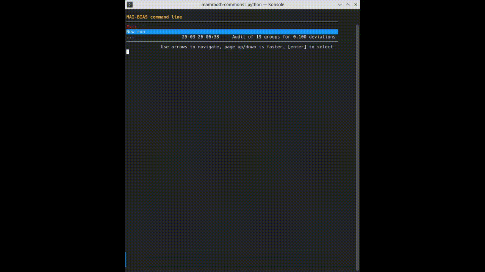

# MAI-BIAS modules

[](https://github.com/mammoth-eu/mammoth-commons/actions/workflows/integration.yml)

[](code_of_conduct.md) 

*Quickly develop and locally run MAI-BIAS toolkit modules.*

This repository is created by the [MAMMOth](https://mammoth-ai.eu/)
project and holds the mammoth-commons library, which contains 
supporting datatypes and decorators for developing fairness modules.
It also hosts a catalogue of 30+ modules. 
Finally, find desktop and terminal applications that 
run those modules in your local machine.



## 🔬 [Run locally](README.md)

## 🖥️ Run in terminal

Follow the same instructions for running locally, with the difference that the command line 
interface module is launched at the last step. This has equivalent
functionality to the desktop app but does not leave the terminal.

```bash
# may need to replace python with python3
python --version
pip install mai-bias
python -m python -m mai_bias.cli
```


 
## ☁️ [Deploy in a server](https://github.com/mammoth-eu/mammoth-toolkit-releases)

## 🦣 [Module catalogue](https://mammoth-eu.github.io/mammoth-commons/)

## 👍 [Contribute](CONTRIBUTING.md)
